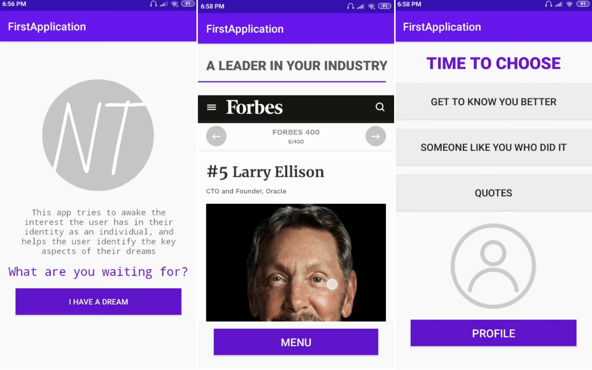

# First Android Application
## Who, What, When



This app aims to awaken the interest the user has in their identity as an individual and helps them identify the key aspects of their dreams, so they can turn their deepest ambitions into achievable goals. It was initially created to test my Android development skills and experiment with what I learned from an online course. 

A project-centered course helped me complete this personally meaningful project.

- The app is in Spanish and English
- Counts with two forms that use Shared Preferences to store the data
- Allows the user to send an SMS text to any phone number (Explicit Intends)
- Displays web pages


### Tech

The app uses different frameworks, languages, and tools to work properly. Main technologies:

* [Android Studio] - the official IDE for Google's Android operating system
* [Java] - object-oriented programming language

### Installation
The Food Journal Tracker requires [Android Studio](https://developer.android.com/studio) to run.

Clone this repository and import into Android Studio.

```
https://github.com/ahn-nath/FirstApplication.git
```
For more information on how to run the app on a real device or an emulator after importing it, follow this [tutorial](https://developer.android.com/training/basics/firstapp/running-app).

### Adittional 

If you would like to know more about the project and its functionalities:

| Resource | URL|
| ------ | ------ |
| Demo video on Youtube | [First Android Application][youtube-demo] |
| Project-centered course | [Build Your First Android App][course] |


**Any feedback is always welcome!**

[//]: # (These are reference links used in the body of this note and get stripped out when the markdown processor does its job.)

   [Android Studio]: <https://developer.android.com/studio>
   [Java]: <https://www.java.com/>

   [youtube-demo]: <https://www.youtube.com/watch?v=T3vbLMzoNRU>
   [course]: <https://www.coursera.org/learn/android-app>


 
